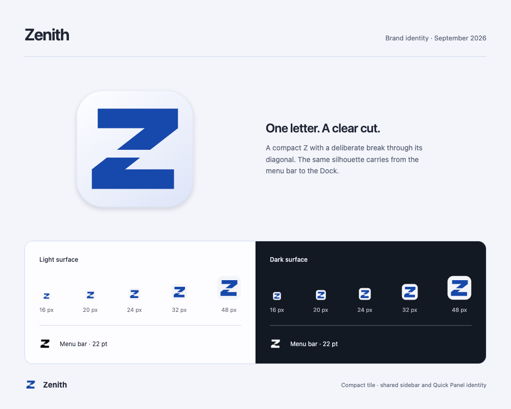

# Zenith split Z

The user selected a minimal Z that stays clear at small sizes. The new mark
keeps two substantial diagonal segments and a visible central cut, using
Zenith's existing cobalt rather than a separate status-colored dot.

Open [the responsive review sheet](logo-preview.html) to inspect 16, 20, 24, 32,
and 48 px artwork on light and dark surfaces, plus the 22 pt menu-bar template.

## Source and usage

- Master geometry: `src-tauri/icons/zenith-mark.svg`.
- Authoring palette and exports: `scripts/generate_icons.mjs`.
- Regenerate: `pnpm icons:generate`. Check committed exports: `pnpm icons:check`.
- Dock/Finder/installer: full app tile, including `.icns`, `.ico`, and all
  previously tracked platform sizes. Historical mobile exports are regenerated
  for consistency; this does not add mobile platform support.
- Sidebar and Quick Panel: compact SVG through the existing `BrandIcon` registry.
  Its asset hash is generated with the artwork. Third-party marks are untouched.
- Web: SVG favicon with PNG fallback, public app/icon assets, README logo.
- macOS menu bar: 44 px black-alpha template at 22 pt; AppKit owns appearance.
  Windows/Linux tray: full-color icon instead of a black template.

The app tile has a subtle relief; the compact tile removes external shadow and
bundle padding. The mark's geometry is identical in all exports. No window
material, global UI color, font, layout, or cleanup rule changes are included.

## Verification — September 26, 2026

Version 0.3.61; issue-306 working tree based on `61283ac`.
Host: macOS 27.0 (26A428).

Passed: `pnpm icons:check`, `pnpm check` (zero errors/warnings),
`pnpm test -- --run` (394 tests / 41 files), `pnpm build`,
`cargo check --workspace`, `cargo test --workspace`,
`cargo fmt --all -- --check`, `just build-fast`, and `git diff --check`.

The packaged debug app's `Contents/Resources/icon.icns` was compared byte for
byte with the generated ICNS. The ICNS encoder's unordered record output is
canonicalized so repeat generation is deterministic.

Browser inspection:

- Review sheet: 320, 375, 414, 768, and 1000 px widths; all assets loaded and
  root scroll width equaled the viewport. The 1000 px capture is shown above.
- [Dashboard](dashboard.png): real browser preview at 960 × 660.
- [Quick Panel](quick-panel.png): real browser preview at 400 × 740.

These browser images contain mock data and do not demonstrate native glass.
The installed application was not replaced. Dock icon caching and Windows
native shell rendering were not inspected in this pass.
