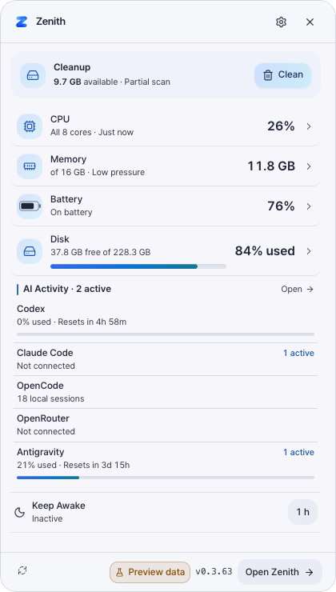
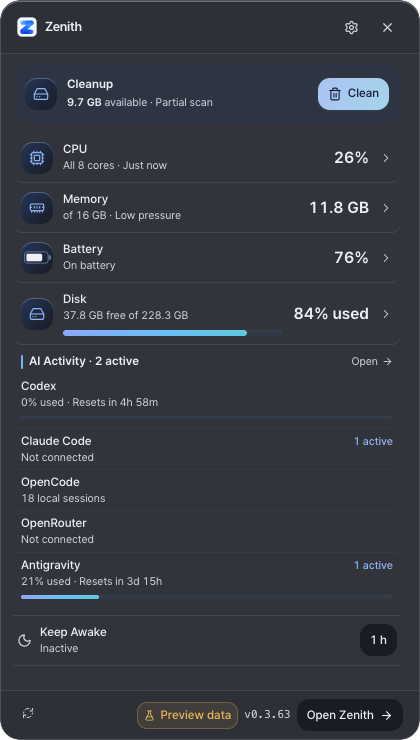
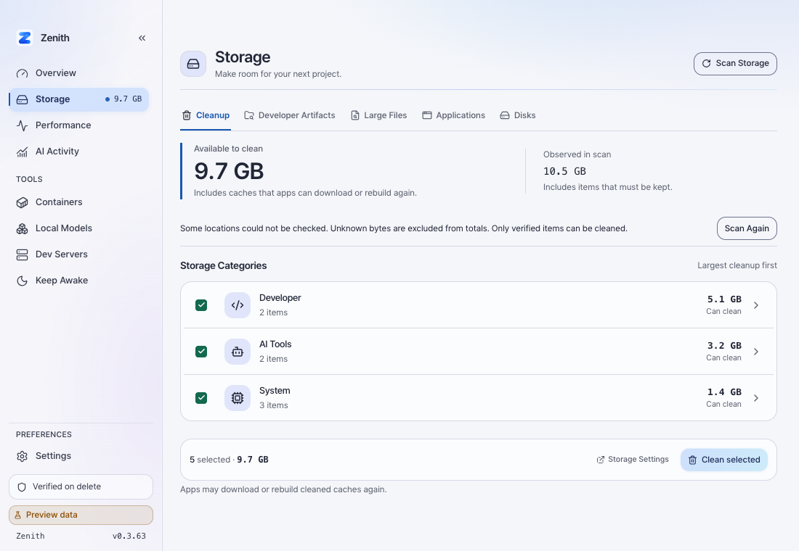

# Direct Cache Cleanup and Blue Accent Validation

- Issue: [#311](https://github.com/jaeyoung0509/zenith/issues/311)
- Date: 2026-09-26
- Version: 0.3.62 -> 0.3.63
- Host: macOS 27.0, build 26A428

## Local Checks

- `cargo check`: passed.
- `cargo test --workspace`: passed, including temporary-fixture cleanup and safety regressions. Existing ignored export tests were run separately through `just generate-bindings`.
- `cargo fmt --all -- --check`: passed.
- `cargo clippy --workspace --all-targets -- -D warnings`: passed.
- `just check-architecture`: passed.
- `pnpm check`: zero errors and warnings.
- `pnpm test -- --run`: 42 files, 402 tests passed, including the AI freshness follow-up regressions.
- `pnpm build`: passed.
- `just generate-bindings`: passed; generated contract comments updated.
- Scan benchmark baseline export and drift check: passed, no baseline changes.
- `just check-version`: all manifests and workspace lock entries report 0.3.63.
- `just build-fast`: passed. Bundle Info.plist reports 0.3.63 and references icon.icns; packaged icon SHA-256 matches the source icon.

## Browser Checks

Screenshots use deterministic preview data, not the live disk measurement below.

- Quick Panel at 420 x 740 in light and dark themes; also checked at 375 x 740 without horizontal overflow.
- Storage at 1100 x 760; at 960 x 660 there is no horizontal overflow and Clean selected stays visible.
- Quick Panel Clean dispatches the displayed scan ID and exact eligible item IDs, including an eligible Rebuild cache, without a review dialog.
- Storage Clean selected prepares a backend plan and executes a plan without confirmation requirements directly. Stateful plans retain the confirmation branch.
- Interaction dispatch was verified with browser-only method stubs; no native deletion was triggered by browser automation.
- Automated contrast checks cover both action-gradient endpoints (4.5:1 text contrast) and all three gauge stops (3:1 track contrast) in both themes.
- Follow-up: AI Activity rows now display accessible usage meters using the same percentage window as their text. Zero usage retains an empty track; session-only, disconnected, loading, stale, and non-finite data do not produce a meter. Helper regressions cover clamping and missing data. Updated light/dark screenshots and a 375 x 740 check confirm two measured-provider meters without horizontal overflow or footer overlap.
- Freshness follow-up: a streamed Codex result no longer inherits an old aggregate timestamp while another provider is pending. Fake-timer tests cover slow-provider completion and aggregate failure without marking untouched providers fresh. Quick Panel now subscribes to the existing visible-only TTL refresh and disposes it on hide; stale copy reads `Usage needs refresh`, not quota exhaustion.
- Native glass tokens, translucency, and blur rules are unchanged. Browser evidence does not validate native macOS compositing.

## Read-Only Disk Observation

`cargo run -q -p zenith-desktop --example scan_machine -- --live-read-only --full-catalog-read-only` completed without mutation on this host.

- Observed: 4,490,051,584 bytes.
- Cleanable: 1,196,056,576 bytes.
- Selected: 1,158,467,584 bytes.
- Quality: partial; 11 incomplete items, with permission and I/O gaps.
- Scope: full embedded catalog with intensive mode enabled, not the default-only scan.

This is not a controlled before/after benchmark or a claim of parity with Mole or Cleaner One. No real user cache was deleted. Trash-based strategies remain recoverable and do not immediately reclaim disk space until Trash is emptied.

## Remaining Platform Verification

The installed/running app was not replaced. Native Quick Panel interaction and translucent compositing were not manually exercised in the rebuilt app. Windows runtime behavior was not exercised locally; PR CI status is reported separately from these local checks. No release, tag, or merge was performed.
